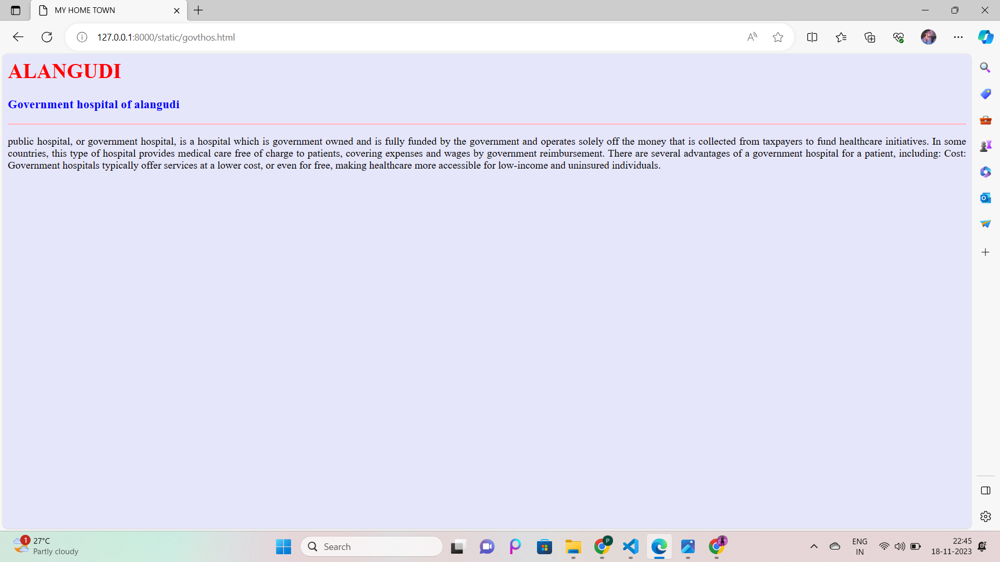

# Ex04 Places Around Me
## Date: 18.11.2023

## AIM
To develop a website to display details about the places around my house.

## DESIGN STEPS

### STEP 1
Create a Django admin interface.

### STEP 2
Download your city map from Google.

### STEP 3
Using ```<map>``` tag name the map.

### STEP 4
Create clickable regions in the image using ```<area>``` tag.

### STEP 5
Write HTML programs for all the regions identified.

### STEP 6
Execute the programs and publish them.

## CODE
```
map.html
<html>
<head>
<title>My City</title>
</head>
<body>
<h1 align="center">
<font color="red"><b>Alangudi</b></font>
</h1>
<h3 align="center">
<font color="red"><b>Prideesh M (23007215)</b></font>    
</h3>
<center>

<map name="MyCity">
<area shape="rect" coords="750,400,600,650" href="institutions.html" title="J Group Of Institutions"> 
<area shape="rect" coords="600,300,900,800" href="home.html" title="My Home Town">
<area shape="rect" coords="700,200,900,400" href="mahal.html" title="Subam Mahal"> 
<area shape="rect" coords="600,200,700,600" href="busstand.html" title="Alangudi Bus Stand">  
<area shape="rect" coords="900,100,200,300" href="govthos.html" title="Government Hospital Alangudi">     
</map> 
</center8
</body>
</html>

home.html
<html>
    <head>
        <title>MY HOME TOWN</title>

    </head>
    <body bgcolor ="PURPLE">
        <h1 align=""centre">
        <font color="black"><b>ALANGUDI</b></font>
    </h1>
    <h3 align="centre">
        <font color="blue"><b>MY HOME</b></font>
    </h3>
    <hr size="3" color="red">
    <p align="justify">
<font face "Georgia" size="5"></font>
My beautiful house is on the outskirts of the town. We have built our house on a suitable plot with a garden space and greenery
 to enjoy. My house has two bedrooms and a living room, along with a kitchen and a dining room and dinning hall. Near my home there is an
 sea is there.where we me and my friends went to that beach and enjoy ourselves.in my home there is an dog and its name is abi. 
 it was cute and charm... Near my home there is an ground is there where me and my friends are used to play cricket regularly..
</p >
    </body>
</html>

mahal.html


<html>
    <head>
        <title>MY HOME TOWN</title>

    </head>
    <body bgcolor ="red">
        <h1 align="centre">
        <font color="black"><b>ALANGUDI</b></font>
    </h1>
    <h3 align="centre">
        <font color="green"><b>Subam mahal</b></font>
    </h3>
    <hr size="3" color="white">
    <p align="justify">
<font face "Georgia" size="5"></font>
Our subam mahal in alangudi is an air conditioned hall with
 a seating capacity of 1000 and a floating capacity of 2050. The Kalyana Mandapams provides
 air conditioned rooms with locker facility for the guests. You can contact us via Matrimony Mandaps for the best services.
 The Dining capacity of menakshi sundherasan mahal is 200. The Function hall is in Ground floor. Parking facility is available for 200 cars 
 and 300 bikes. There is generator back up for the event to function smoothly during power cut. It was the biggest mahal in the  particular location..
</p >
    </body>
</html>

govthos.html

<html>
    <head>
        <title>MY HOME TOWN</title>

    </head>
    <body bgcolor ="lavender">
        <h1 align=""centre">
        <font color="red"><b>ALANGUDI</b></font>
    </h1>
    <h3 align="centre">
        <font color="blue"><b>Government hospital of alangudi</b></font>
    </h3>
    <hr size="3" color="pink">
    <p align="justify">
<font face "Georgia" size="5"></font>
public hospital, or government hospital, is a hospital which is government owned and is fully funded by the government
 and operates solely off the money that is collected from taxpayers to fund healthcare initiatives. In some countries, this
 type of hospital provides medical care free of charge to patients, covering expenses and wages by government reimbursement.
 There are several advantages of a government hospital for a patient, including: Cost: Government hospitals typically offer 
 services at a lower cost, or even for free, making healthcare more accessible for low-income and uninsured individuals.
</p >
    </body>
</html>

busstand.html


<html>
    <head>
        <title>MY HOME TOWN</title>

    </head>
    <body bgcolor ="green">
        <h1 align=""centre">
        <font color="red"><b>ALANGUDI</b></font>
    </h1>
    <h3 align="centre">
        <font color="white"><b>Busstand of alangudi</b></font>
    </h3>
    <hr size="3" color="lavander">
    <p align="justify">
<font face "Georgia" size="5"></font>
A bus stand, also called a bus bay, or bus stance, is a designated parking location where a bus or
 coach waits out of service between scheduled public transport services. 'Bus stand' is also often an
  alternative name for specific bus stops inside a bus station. A bus station is a structure where buses
   stop to pick up and drop off passengers. A bus station is larger than a bus stop, which is usually a
    place on the roadside where buses stop. Some bus stations are terminal stations, which means that station
     is the end of the route.
</p >
    </body>
</html>

institutions.html

<html>
    <head>
        <title>MY HOME TOWN</title>

    </head>
    <body bgcolor ="yellow">
        <h1 align="centre">
        <font color="black"><b>ALANGUDI</b></font>
    </h1>
    <h3 align="centre">
        <font color="green"><b> J Group Of Institutions</b></font>
    </h3>
    <hr size="3" color="white">
    <p align="justify">
    <font face "Georgia" size="5"></font>
    J Groups Educational Institutions has been introduced and established by J Groups Charitable
 Trust is the year of 2009. The groups run many Institutions such as JESU POLYTECHNIC COLLEGE,
  JESU ARTS AND SCIENCE COLLEGE and JESU INSTITUTE OF HOTEL MANAGEMENT AND CATERING TECHNOLOGY.
  it was the famous college in the location  where nearly more than 5000 students are studing 
  and most of them are get placement in highest package..
</p >
    </body>
</html>
```

## OUTPUT





## RESULT
The program for implementing image maps using HTML is executed successfully